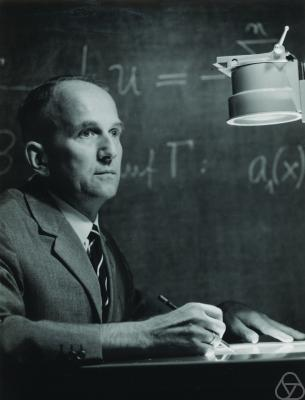

# Collatz Conjecture

## About Collatz 

Collatz was a German mathematician born in Arnsberg in 1930 and died in 1990 in Bulgaria. 

## About Collatz Conjecture 
This is an unsolved matamatical problem. It starts with a positive integer and always ends with 1. 

* If you have an *even number divide by 2* .
* If you have an *uneven number multiply by 3* and *add 1*.
